# Build Your Own Kernel

English | [中文文档](./README.zh_CN.md)

In this part, we will use `Github Action` to perform kernel cloud compilation. The directory structure of this project is as follows:

```sh
.
├── configs
│   ├── markw.config.json
│   ├── thyme.config.json
│   └── wayne.config.json
└── LXC
    ├── LXC_defconfig
    └── Patches
        ├── cgroup.patch
        └── xt_qtaguid.patch
```

The contents and functions of each part are as follows:

- **configs**: used to store the detailed configuration of all kernels to be compiled (kernel source code address, compilation tool chain, compilation parameters and additional compilation options)
- **LXC**: stores some configuration files and patches required for kernel support `Docker`
  - **LXC_defconfig**: Options that need to be enabled for kernel support `Docker`
  - **Patches**: Some patches that need to be applied

## Development progress

- [x] `AnyKernel3` original and customized versions supported
- [x] `KernelSU` compilation support
- [x] `Docker` compilation support
- [x] Use repository owner information to compile
- [ ] Use `MagiskBoot` to generate `boot.img`
- [ ] Compile kernel script locally
- [ ] Web page configuration Json compilation configuration file (to be released soon)
- [ ] Cloud compiled kernel web page

## Github Action

### Introduction to the compilation process

The `Github Action` file for compiling the kernel is [kernel.yml](../.github/workflows/kernel.yml). This Action contains the following two jobs:

- `Read-configuration`: used to read the configuration files in the `configs` folder
- `Build-Kernel`: Compile the text kernel according to the read configuration file, and perform functions such as uploading

### Compilation process timeline

```mermaid
%%{init: { 'logLevel': 'debug', 'theme': 'neutral' } }%%
timeline
    How to build a Kernel
    section Read configuration
        Checkout repository
        Generate configuration matrix
        Set builddate
    section Kernel Build
        Prepare : 📐 Set swap to 10G : 😄 Checkout repository
            : ⭐ Install prerequisites for Ubuntu : 🚄 Setup ccache : 🚅 Restore cache
            : 🌟 Clone kernel source : 💫 Get toolchains
        Basic configuration : 😎 Set build args : 😋 Setup KernelSU : 😋 Setup LXC Docker
            : 👍 Build kernel
    section Post build
        Upload Artifact : 💛 Upload Image : 💙 Upload Image.gz : 💙 Upload Image.gz-dtb
            : 💜 Upload dtb : ❤️ Upload dtbo.img : ☢️ Upload output directory
        Pack Anykernel3 : ⏰ Get Anykernel3 : ⏰ Pack your kernel : 💾 Upload AnyKernel3 package
        Release
```



## Configuration file parsing

Please see [Compile Configuration](./configs/) for specific configuration methods.

## Instructions

The basic usage of this project is as follows:

1. `fork` this project on GitHub

2. Modify the `config/*.config.json` file through the Github web page or pull it locally, and submit the changes

3. View the `Action` page of the Github page and find `Build kernels` and `Run workflow`

4. After the compilation is completed, you can enter the corresponding page to download the compiled product.

5. Use your favorite packaging software for kernel packaging ([AnyKernel3](https://github.com/osm0sis/AnyKernel3), [Android-Image-Kitchen](https://github.com/osm0sis/Android-Image-Kitchen), [MagiskBoot](https://github.com/topjohnwu/Magisk/releases), etc. **Currently this project only integrates AnyKernel3**)


## Local build

### 1. Run `Action` locally

If you don't want to repeatedly execute `Action` on `Github`, you can use [nektos/act](https://github.com/nektos/act) to test this build process and output it in the local environment.

After installing [nektos/act](https://github.com/nektos/act) and execute the following instructions:

```sh
# Collect build files into the /tmp/artifacts folder:
act --artifact-server-path /tmp/artifacts
```

If you need to place it in a local location you like, please change `/tmp/artifacts` to your preferred directory.

If an error is reported during the process, please add the parameter `-v` and re-execute to obtain the error report and submit an `issue`. The specific command is as follows:

```sh
# Collect build files into the /tmp/artifacts folder:
act --artifact-server-path /tmp/artifacts -v
```

## FAQ

### 1. GitHub release failed with status: `403`

When you use `softprops/action-gh-release@v1` to publish `Release`, you may encounter the following error:

```plaintext
👩‍🏭 Creating new GitHub release for tag v20230619.7...
⚠️ GitHub release failed with status: 403
undefined
retrying... (2 retries remaining)
👩‍🏭 Creating new GitHub release for tag v20230619.7...
⚠️ GitHub release failed with status: 403
undefined
retrying... (1 retries remaining)
👩‍🏭 Creating new GitHub release for tag v20230619.7...
⚠️ GitHub release failed with status: 403
undefined
retrying... (0 retries remaining)
❌ Too many retries. Aborting...
Error: Too many retries.
```

This is caused by your `Workflow` not having **read and write permission**:


Open the corresponding read and write permissions as shown above, and then re-run `Action` to publish your own `Release`

# Acknowledgments

- [weishu](https://github.com/tiann) : Developer of KernelSU
- [AKR Android Developer Community](https://www.akr-developers.com/) ： Provides build tutorials
- [DogDayAndroid/KSU_Thyme_BuildBot](https://github.com/DogDayAndroid/KSU_Thyme_BuildBot) : Predecessor of this project
- [xiaoleGun/KernelSU_Action](https://github.com/xiaoleGun/KernelSU_Action) ： Drawing on some Github Actions
- [UtsavBalar1231/Drone-scripts](https://github.com/UtsavBalar1231/Drone-scripts) ： Drawing on some Github Actions
