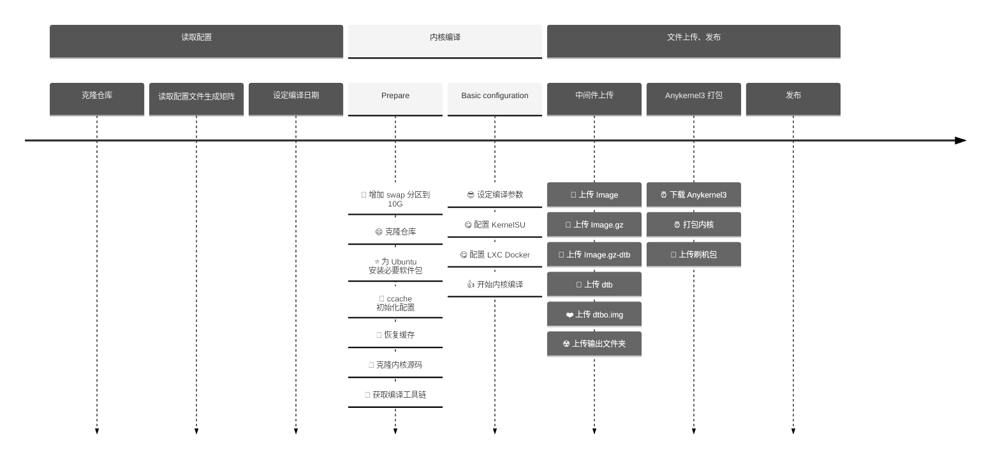

# 构建属于你自己的内核镜像

[English](./README.md) | 中文文档

这部分内容中，我们会利用 `Github Action` 进行内核云编译。本项目的目录结构如下：

```sh
.
├── configs
│   ├── markw.config.json
│   ├── thyme.config.json
│   └── wayne.config.json
└── LXC
    ├── LXC_defconfig
    └── Patches
        ├── cgroup.patch
        └── xt_qtaguid.patch
```

其中各个部分的内容及作用如下：

- **configs**: 用于存储所有待编译内核的详细配置（内核源码地址、编译工具链、编译参数以及额外的编译选项）
- **LXC**: 存放了关于内核支持 `Docker` 所需要的部分配置文件及补丁
  - **LXC_defconfig**：内核支持 `Docker` 所需要开启的选项
  - **Patches**：部分需要应用的补丁

## 开发进度

- [x] `AnyKernel3` 原版及自定义版本支持
- [x] `KernelSU` 编译支持
- [x] `Docker` 编译支持
- [x] 使用仓库所有者信息来编译
- [ ] 使用 `MagiskBoot` 生成 `boot.img`
- [ ] 本地编译内核脚本
- [ ] 网页配置 Json 编译配置文件（即将发布）
- [ ] 云端编译内核网页

## Github Action

### 编译流程介绍

编译内核的 `Github Action` 文件是 [kernel.yml](../.github/workflows/kernel.yml)，该 Action 包含如下两个作业：

- `Read-configuration`：用于读取 `configs` 文件夹内的配置文件
- `Build-Kernel`：根据读取到的配置文件来进行文内核编译，并执行上传等功能

### 编译流程时间线



## 配置文件解析

具体配置方法请查看 [编译配置](./configs/) 。

## 使用方法

本项目的基础使用方法如下：

1. 在 GitHub 上 `fork` 本项目

2. 通过 Github 网页或者拉取到本地修改 `config/*.config.json` 文件，并提交修改

3. 查看 Github 网页的 `Action` 页面，找到 `Build kernels` 并 `Run workflow`

4. 等待编译完成，即可进入对应页面下载编译产物

5. 使用您喜欢的打包软件进行内核打包([AnyKernel3](https://github.com/osm0sis/AnyKernel3)、[Android-Image-Kitchen](https://github.com/osm0sis/Android-Image-Kitchen)、[MagiskBoot](https://github.com/topjohnwu/Magisk/releases) 等，**目前本项目仅集成 AnyKernel3**)


## 本地构建

### 1. 本地运行 `Action`

如果您并不想在 `Github` 上重复执行 `Action`，您可以利用 [nektos/act](https://github.com/nektos/act) 来在本地环境里测试本构建流程并输出。

安装 [nektos/act](https://github.com/nektos/act) 后并执行如下指令:

```sh
# 将构建文件收集到 /tmp/artifacts 文件夹：
act --artifact-server-path /tmp/artifacts
```

如果您需要放在本地你喜欢的位置，请更改 `/tmp/artifacts` 为您喜欢的目录即可。

如果中途报错，请加入参数 `-v` 重新执行获取错误报告并提交 `issue` ，具体命令如下:

```sh
# 将构建文件收集到 /tmp/artifacts 文件夹：
act --artifact-server-path /tmp/artifacts -v
```

## 常见问题

### 1. GitHub release failed with status: `403`

当您使用 `softprops/action-gh-release@v1` 发布 `Release` 时, 您可能会遇到如下报错:

```plaintext
👩‍🏭 Creating new GitHub release for tag v20230619.7...
⚠️ GitHub release failed with status: 403
undefined
retrying... (2 retries remaining)
👩‍🏭 Creating new GitHub release for tag v20230619.7...
⚠️ GitHub release failed with status: 403
undefined
retrying... (1 retries remaining)
👩‍🏭 Creating new GitHub release for tag v20230619.7...
⚠️ GitHub release failed with status: 403
undefined
retrying... (0 retries remaining)
❌ Too many retries. Aborting...
Error: Too many retries.
```

这是由于您的 `Workflow` 没有**读写权限**导致的:


按照上图打开对应读写权限，随后重新运行 `Action` 就可以发布属于你自己的 `Release` 了

# 致谢

- [weishu](https://github.com/tiann) : KernelSU 的开发者
- [AKR 安卓开发者社区](https://www.akr-developers.com/) ： 编译教程提供
- [DogDayAndroid/KSU_Thyme_BuildBot](https://github.com/DogDayAndroid/KSU_Thyme_BuildBot) : 此项目的前身
- [xiaoleGun/KernelSU_Action](https://github.com/xiaoleGun/KernelSU_Action) ： 借鉴部分 Github Action
- [UtsavBalar1231/Drone-scripts](https://github.com/UtsavBalar1231/Drone-scripts) ： 借鉴部分 Github Action
