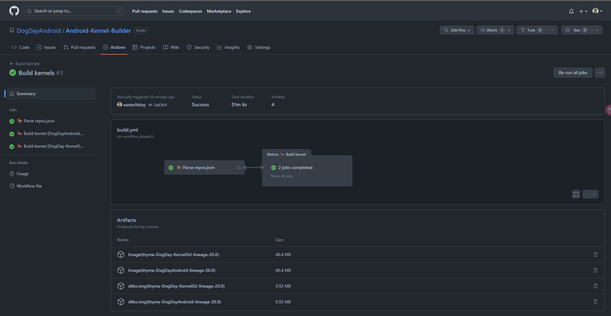

<div align = center>


<h1>构建属于你自己的安卓内核镜像</h1>


这个 Github Action 可以帮助你构建内核。它可以从一个配置文件中读取多个内核源，并使用不同的工具链构建它们。此外，它还支持使用 KernelSU 进行内核补丁，并上传构建好的内核镜像。
<br>

---

**[<kbd> <br>  配置文件使用方法  <br> </kbd>](#配置文件解析)** 
**[<kbd> <br>  快速开始  <br> </kbd>](#使用方法)** 
**[<kbd> <br>  本地构建  <br> </kbd>](#本地构建)**

---

</div>

# Github Action

该 Action 包含两个作业：`Set-repos` 和 `Build-Kernel`。

Set-repos 作业从配置文件中读取内核源，并将其输出到 Build-Kernel 作业中。Build-Kernel 作业使用输出的内核源构建内核，并上传构建好的内核镜像。

## 启动方式

| 事件名称          | 描述           |
| ----------------- | -------------- |
| workflow_dispatch | 手动触发构建。 |

## 构建流程

| 步骤                    | 描述                     |
| ----------------------- | ------------------------ |
| Install prerequisites   | 安装构建所需的依赖       |
| Setup Anykernel3        | 克隆 Anykernel3 仓库     |
| Clone kernel source     | 克隆内核源码仓库         |
| Get toolchains          | 获取所需的交叉编译工具链 |
| Set args                | 设置构建参数             |
| Update KernelSU         | 更新 KernelSU            |
| Make defconfig          | 生成内核配置文件         |
| Build kernel            | 编译内核                 |
| Upload Image            | 上传内核镜像文件         |
| Upload Image.gz         | 上传内核镜像压缩文件     |
| Upload dtb              | 上传设备树文件           |
| Upload dtbo.img         | 上传设备树覆盖文件       |
| Pack AnyKernel3.zip     | 打包 Anykernel3.zip      |
| Upload AnyKernel3 image | 上传 Anykernel3 镜像文件 |
| Create GitHub Release   | 创建 GitHub Release      |

# 配置文件解析

## 基本配置文件案例

<details>
  <summary>🤔 点击查看例子</summary>

```json
[
  {
    "kernelSource": {
      "name": "DogDay-KernelSU-Proton-release",
      "repo": "https://codeberg.org/DogDayAndroid/android_kernel_xiaomi_thyme",
      "branch": "lineage-20.0",
      "device": "thyme",
      "defconfig": "thyme_defconfig"
    },
    "withKernelSU": true,
    "toolchains": [
      {
        "repo": "https://github.com/kdrag0n/proton-clang",
        "branch": "master",
        "name": "proton-clang",
        "binPath": ["bin"]
      }
    ],
    "ccache": false,
    "params": {
      "ARCH": "arm64",
      "CC": "proton-clang/bin/clang",
      "externalCommand": {
        "CROSS_COMPILE": "proton-clang/bin/aarch64-linux-gnu-",
        "CROSS_COMPILE_ARM32": "proton-clang/bin/arm-linux-gnueabi-",
        "LD": "proton-clang/bin/ld.lld",
        "AR": "proton-clang/bin/llvm-ar",
        "NM": "proton-clang/bin/llvm-nm",
        "OBJCOPY": "proton-clang/bin/llvm-objcopy",
        "OBJDUMP": "proton-clang/bin/llvm-objdump",
        "READELF": "proton-clang/bin/llvm-readelf",
        "OBJSIZE": "proton-clang/bin/llvm-size",
        "STRIP": "proton-clang/bin/llvm-strip",
        "LDGOLD": "proton-clang/bin/aarch64-linux-gnu-ld.gold",
        "LLVM_AR": "proton-clang/bin/llvm-ar",
        "LLVM_DIS": "proton-clang/bin/llvm-dis"
      }
    },
    "AnyKernel3": {
      "use": true,
      "release": true,
      "repo": "https://github.com/easterNday/AnyKernel3/",
      "branch": "thyme"
    }
  },
  {
    "kernelSource": {
      "name": "DogDay-KernelSU-Proton-noanykernel-release",
      "repo": "https://codeberg.org/DogDayAndroid/android_kernel_xiaomi_thyme",
      "branch": "lineage-20.0",
      "device": "thyme",
      "defconfig": "thyme_defconfig"
    },
    "withKernelSU": true,
    "toolchains": [
      {
        "repo": "https://github.com/kdrag0n/proton-clang",
        "branch": "master",
        "name": "proton-clang",
        "binPath": ["bin"]
      }
    ],
    "ccache": true,
    "params": {
      "ARCH": "arm64",
      "CC": "proton-clang/bin/clang",
      "externalCommand": {
        "CROSS_COMPILE": "proton-clang/bin/aarch64-linux-gnu-",
        "CROSS_COMPILE_ARM32": "proton-clang/bin/arm-linux-gnueabi-",
        "LD": "proton-clang/bin/ld.lld",
        "AR": "proton-clang/bin/llvm-ar",
        "NM": "proton-clang/bin/llvm-nm",
        "OBJCOPY": "proton-clang/bin/llvm-objcopy",
        "OBJDUMP": "proton-clang/bin/llvm-objdump",
        "READELF": "proton-clang/bin/llvm-readelf",
        "OBJSIZE": "proton-clang/bin/llvm-size",
        "STRIP": "proton-clang/bin/llvm-strip",
        "LDGOLD": "proton-clang/bin/aarch64-linux-gnu-ld.gold",
        "LLVM_AR": "proton-clang/bin/llvm-ar",
        "LLVM_DIS": "proton-clang/bin/llvm-dis"
      }
    },
    "AnyKernel3": {
      "use": false,
      "release": true,
      "repo": "https://github.com/easterNday/AnyKernel3/",
      "branch": "thyme"
    }
  },
  {
    "kernelSource": {
      "name": "DogDay-KernelSU-Proton-anykernel-norelease",
      "repo": "https://codeberg.org/DogDayAndroid/android_kernel_xiaomi_thyme",
      "branch": "lineage-20.0",
      "device": "thyme",
      "defconfig": "thyme_defconfig"
    },
    "withKernelSU": false,
    "toolchains": [
      {
        "repo": "https://github.com/kdrag0n/proton-clang",
        "branch": "master",
        "name": "proton-clang",
        "binPath": ["bin"]
      }
    ],
    "ccache": true,
    "params": {
      "ARCH": "arm64",
      "CC": "proton-clang/bin/clang",
      "externalCommand": {
        "CROSS_COMPILE": "proton-clang/bin/aarch64-linux-gnu-",
        "CROSS_COMPILE_ARM32": "proton-clang/bin/arm-linux-gnueabi-",
        "LD": "proton-clang/bin/ld.lld",
        "AR": "proton-clang/bin/llvm-ar",
        "NM": "proton-clang/bin/llvm-nm",
        "OBJCOPY": "proton-clang/bin/llvm-objcopy",
        "OBJDUMP": "proton-clang/bin/llvm-objdump",
        "READELF": "proton-clang/bin/llvm-readelf",
        "OBJSIZE": "proton-clang/bin/llvm-size",
        "STRIP": "proton-clang/bin/llvm-strip",
        "LDGOLD": "proton-clang/bin/aarch64-linux-gnu-ld.gold",
        "LLVM_AR": "proton-clang/bin/llvm-ar",
        "LLVM_DIS": "proton-clang/bin/llvm-dis"
      }
    },
    "AnyKernel3": {
      "use": true,
      "release": false,
      "repo": "https://github.com/easterNday/AnyKernel3/",
      "branch": "thyme"
    }
  }
]
```

</details>

<details>
  <summary>😲 单个配置模板</summary>

```json
{
  "kernelSource": {
    "name": "",
    "repo": "",
    "branch": "",
    "device": "",
    "defconfig": ""
  },
  "withKernelSU": false,
  "toolchains": [
    {
      "repo": "",
      "branch": "",
      "name": "",
      "binPath": []
    }
  ],
  "ccache": false,
  "params": {
    "ARCH": "",
    "CC": "",
    "externalCommand": {}
  },
  "AnyKernel3": {
    "use": false,
    "release": false,
    "repo": "",
    "branch": ""
  }
}
```

</details>

## 参数解析

总体来说，一共有如下

| 字段名称     | 描述                                                                                           |
| ------------ | ---------------------------------------------------------------------------------------------- |
| kernelSource | 内核源代码的相关信息，包括名称、仓库地址、分支和设备类型。                                     |
| withKernelSU | 一个布尔值，表示是否使用了名为 `KernelSU` 的内核补丁。                                         |
| toolchains   | 一个数组，包含了需要用到的工具链的相关信息，包括仓库地址、分支和名称。                         |
| ccache       | 一个布尔值，表示是否使用了名为 `ccache` 的编译工具来加速编译。                                 |
| params       | 一个对象，包含了构建参数的相关信息，其中包括了架构类型、交叉编译器、编译器等信息。             |
| AnyKernel3   | 一个对象，包含了构建内核刷机包的相关信息，其中包括了使用的 `AnyKernel3` 仓库地址、分支等信息。 |

### 内核源码配置(kernelSource)

| 内核源码相关参数 | 类型   | 说明             | 详细说明                                                               |
| ---------------- | ------ | ---------------- | ---------------------------------------------------------------------- |
| `name`           | 字符串 | 内核名称         | 自定义，会在发布的时候使用此字段                                       |
| `repo`           | 字符串 | 内核源码仓库地址 | 内核源码的 `git` 仓库地址                                              |
| `branch`         | 字符串 | 内核源码所在分支 | 对应仓库的指定分支                                                     |
| `device`         | 字符串 | 设备代号         | 所需要编译的设备代号或者名称，会在发布的时候使用此字段                 |
| `defconfig`      | 字符串 | 内核配置文件名称 | 对应编译的 `defconfig` 文件前缀，例如 `thyme_defconfig` 就填写 `thyme` |

### 工具链配置(toolchains)

这是一个数组，容纳了许多交叉编译工具链的仓库对象，每一个配置对象的参数说明如下：

| 工具链相关参数 | 类型   | 说明                 | 详细说明                                                                                                             |
| -------------- | ------ | -------------------- | -------------------------------------------------------------------------------------------------------------------- |
| `repo`         | 字符串 | 工具链仓库地址       | 工具链对应的 `git` 仓库地址                                                                                          |
| `branch`       | 字符串 | 工具链所在分支       | 对应仓库的指定分支                                                                                                   |
| `url`          | 字符串 | 工具链所在下载地址   | 对应编译工具链的地址                                                                                                 |
| `name`         | 字符串 | 工具链名称           | 克隆到本地的文件夹名称，自定义                                                                                       |
| `binPath`      | 数组   | 工具链二进制文件路径 | 编译时候会用到的 `bin` 文件所在的路径(相对于克隆后所在文件夹的路径)<br/>在编译的时候会转化为**绝对路径**进行参数设置 |

因此你可以使用如下几形式来获取编译工具链:

#### 1. 使用 `Git` 拉取编译工具链

```json
"toolchains": [
  {
    "repo": "https://github.com/kdrag0n/proton-clang",
    "branch": "master",
    "name": "proton-clang",
    "binPath": ["./bin"]
  }
]
```

#### 2. 使用 `wget` 下载编译工具链

这种方式可以获取到 `.zip` | `.tar` | `.tar.gz` | `.rar` 格式的编译工具链压缩包。

```json
"toolchains": [
  {
    "url": "https://android.googlesource.com/platform/prebuilts/clang/host/linux-x86/+archive/refs/heads/master-kernel-build-2022/clang-r450784d.tar.gz",
    "name": "clang",
    "binPath": ["./bin"]
  },
  {
    "url": "https://android.googlesource.com/platform/prebuilts/gcc/linux-x86/aarch64/aarch64-linux-android-4.9/+archive/refs/tags/android-12.1.0_r27.tar.gz",
    "name": "gcc",
    "binPath": ["bin"]
  }
]
```

#### 3. 混合模式(同时使用 `Git` 和 `wget`)

```json
"toolchains": [,
  {
    "repo": "https://gitlab.com/ThankYouMario/android_prebuilts_clang-standalone/",
    "branch": "11",
    "name": "clang",
    "binPath": ["bin"]
  },
  {
    "url": "https://android.googlesource.com/platform/prebuilts/gcc/linux-x86/aarch64/aarch64-linux-android-4.9/+archive/refs/tags/android-12.1.0_r27.tar.gz",
    "name": "gcc",
    "binPath": ["bin"]
  }
]
```

### 编译参数(params)

| 编译参数          | 类型   | 说明         | 详细说明                                  |
| ----------------- | ------ | ------------ | ----------------------------------------- |
| `ARCH`            | 字符串 | 架构         | 设备的架构，可以使用 `uname -m` 查询      |
| `CC`              | 字符串 | C 编译器路径 | 所使用的编译器，一般为 `clang` 或者 `gcc` |
| `externalCommand` | 对象   | 外部命令路径 | 编译所需要的额外的参数设定                |

对于 `externalCommand` 部分，下面先给出一个编译时候可能用到的指令例子：

```sh
make -j$(nproc --all) \
      O=out \
      ARCH=arm64 \
      CC=clang \
      CLANG_TRIPLE=aarch64-linux-gnu- \
      CROSS_COMPILE=aarch64-linux-gnu- \
      CROSS_COMPILE_ARM32=arm-linux-gnueabi-
```

其中 `-j` 和 `O=out` 这一部分会由编译脚本自动配置好，`ARCH` 以及 `CC` 部分对应上面的配置，其他部分则对应 `externalCommand` 部分，所以对应 `toolchains` 部分的配置应该为:

```json
"params": {
  "ARCH": "arm64",
  "CC": "clang",
  "externalCommand": {
    "CLANG_TRIPLE": "aarch64-linux-gnu-",
    "CROSS_COMPILE": "proton-clang/bin/aarch64-linux-gnu-",
    "CROSS_COMPILE_ARM32": "proton-clang/bin/arm-linux-gnueabi-"
  }
}
```

### 内核刷机包配置(AnyKernel3)

| AnyKernel3 参数 | 类型   | 说明                | 详细说明                                                                 |
| --------------- | ------ | ------------------- | ------------------------------------------------------------------------ |
| `use`           | 布尔值 | 是否使用 AnyKernel3 | 如果设置为 `false` 则不打包对应内核刷机包                                |
| `release`       | 布尔值 | 是否为发布版本      | 必须 `use` 为 `true` 时才生效，如果设置为 `false` 则不发布对应内核刷机包 |
| `repo`          | 字符串 | AnyKernel3 仓库地址 | 所使用的 `Anykernel3` 的仓库地址                                         |
| `branch`        | 字符串 | AnyKernel3 所在分支 | 对应仓库的指定分支                                                       |

# 使用方法

本项目的基础使用方法如下：

1. 在 GitHub 上 `fork` 本项目

2. 通过 Github 网页或者拉取到本地修改 `repos/repos*.json` 文件，并提交修改

3. 查看 Github 网页的 `Action` 页面，找到 `Build kernels` 并 `Run workflow`

> **注意**
>
> 执行这一步骤时, 在用 `softprops/action-gh-release@v1` 发布 `Release`, 您可能会遇到如下报错:
>
> ```
> 👩‍🏭 Creating new GitHub release for tag v20230619.7...
> ⚠️ GitHub release failed with status: 403
> undefined
> retrying... (2 retries remaining)
> 👩‍🏭 Creating new GitHub release for tag v20230619.7...
> ⚠️ GitHub release failed with status: 403
> undefined
> retrying... (1 retries remaining)
> 👩‍🏭 Creating new GitHub release for tag v20230619.7...
> ⚠️ GitHub release failed with status: 403
> undefined
> retrying... (0 retries remaining)
> ❌ Too many retries. Aborting...
> Error: Too many retries.
> ```
>
> 这是由于您的 `Workflow` 权限导致的:
>
> 
>
> 设置对应权限然后就可以发布属于你自己的 `Release` 了

4. 等待编译完成，即可进入对应页面下载编译产物

5. 使用您喜欢的打包软件进行内核打包([AnyKernel3](https://github.com/osm0sis/AnyKernel3)、[Android-Image-Kitchen](https://github.com/osm0sis/Android-Image-Kitchen)、[MagiskBoot](https://github.com/topjohnwu/Magisk/releases) 等)



# 本地构建

如果您并不想在 `Github` 上重复执行 `Action`，您可以利用 [nektos/act](https://github.com/nektos/act) 来在本地环境里测试本构建流程并输出。

## 普通本地构建(内核源码等使用 `Git` 拉取)

这种方式是推荐的本地测试流程，您只需要安装 [nektos/act](https://github.com/nektos/act) 并执行如下指令:

```sh
# 将构建文件收集到 /tmp/artifacts 文件夹：
act --artifact-server-path /tmp/artifacts
```

如果您需要放在本地你喜欢的位置，请更改 `/tmp/artifacts` 为您喜欢的目录即可。

如果中途报错，请加入参数 `-v` 重新执行获取错误报告并提交 `issue` ，具体命令如下:

```sh
# 将构建文件收集到 /tmp/artifacts 文件夹：
act --artifact-server-path /tmp/artifacts -v
```

## 完全本地构建(内核源码等均为本地存储)

用上述方式构建仍然需要内核源码等存储在云端，如果您一定有要**全部**本地构建的需求，请考虑通过如下方式构建：

1. 搭建本地 `Gitea` 或 `Gitlab` 等 `Git` 服务。随后修改配置文件地址为本地服务地址。

2. 在本地利用 `git daemon` 指令建立一个二级镜像。

此处仅仅提供思路，并不提供具体教程。

# TODO 列表

- 使用 `MagiskBoot` 来生成 `boot.img`
- 生成配置文件的网页

# 致谢

- [weishu](https://github.com/tiann) : KernelSU 的开发者
- [AKR 安卓开发者社区](https://www.akr-developers.com/) ： 编译教程提供
- [DogDayAndroid/KSU_Thyme_BuildBot](https://github.com/DogDayAndroid/KSU_Thyme_BuildBot) : 此项目的前身
- [xiaoleGun/KernelSU_Action](https://github.com/xiaoleGun/KernelSU_Action) ： 借鉴部分 Github Action
- [UtsavBalar1231/Drone-scripts](https://github.com/UtsavBalar1231/Drone-scripts) ： 借鉴部分 Github Action

# 贡献者

<a href="https://github.com/DogDayAndroid/Android-Kernel-Builder/graphs/contributors">
  
</a>

# Star 历史

[](https://starchart.cc/DogDayAndroid/Android-Kernel-Builder)

# 许可

<a rel="license" href="http://creativecommons.org/licenses/by-nc-sa/4.0/"></a><br />本作品采用<a rel="license" href="http://creativecommons.org/licenses/by-nc-sa/4.0/">知识共享署名-非商业性使用-相同方式共享 4.0 国际许可协议</a>进行许可。
